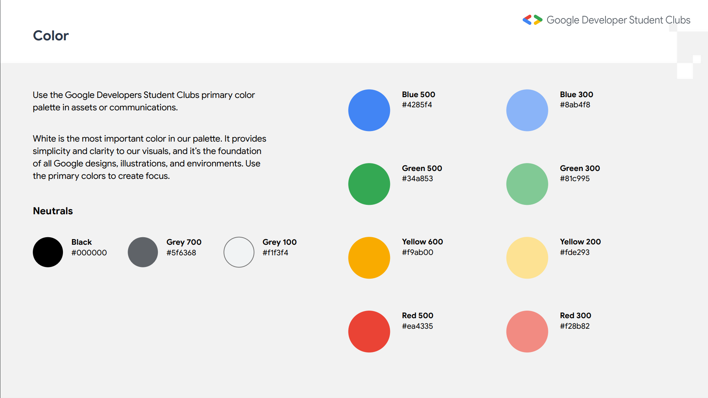

# Intro to Software Development through Web Development

- [Intro to Software Development through Web Development](#intro-to-software-development-through-web-development)
  - [How to contribute to this repo](#how-to-contribute-to-this-repo)
  - [Brand Kit](#brand-kit)
    - [Colors](#colors)
    - [Fonts](#fonts)
  - [Libraries Used](#libraries-used)

## How to contribute to this repo

1. (For members outside the organization) Fork your own copy of this repo from the development branch and work on it.
2. This project uses Vite. Run the following commands to get started on your machine:
``` ruby
npm install
npm run dev
```
3. (For members of the organization)Create your own branch using the following convention:
   - If you are creating a **feature**, your branch should be named in the following format:  
   `feature/name-of-the-feature`
   - If you are working on **fixing a bug**:  
   `bugfix/name-of-the-bug`
   - If you are working on an **enhancement**:  
   `enhancement/name-of-the-enhancement`
   - If you are working on something bigger like building an entire section on a webpage:  
   `task/name-of-the-chore`
4. Create a pull request to the `development` branch. Do not commit the change directly to the `main` branch.

## Brand Kit

### Colors

**Blue:** Blue 500 #4285f4 | Blue 300 #8ab4f8  
**Green:** Green 500 #34a853 | Green 300 #81c995  
**Yellow:** Yellow 500 #f9ab00 | Yellow 300 #fde293    
**Red:** Red 500 #ea4335 | Red 300 #f28b82  
**Neutrals:** Black #000000 | Grey 700 #5f6368 | Grey 100 #f1f3f4  



### Fonts

Headings: Manrope ExtraBold 800  
SubHead: Roboto Mono Regular 400  
Body: Open Sans Regular 400  

Manrope: [Link](https://fonts.google.com/specimen/Manrope)  
Roboto Mono: [Link](https://fonts.google.com/specimen/Roboto+Mono)  
Open Sans: [Link](https://fonts.google.com/specimen/Open+Sans)  

## Libraries Used

- BrowserRouter
- axios
- ReactGoogleForms
